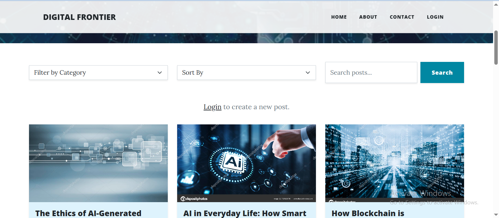

# Digital Frontier - Tech Blog Website



---

## 1. Installation

### 1.1 Clone the repository
```bash
git clone https://github.com/RaoGhulam/digital_frontier.git
cd digital_frontier
```

### 1.2 Create and activate a virtual environment (optional but recommended)
```bash
# Create a virtual environment
python -m venv venv

# Activate the virtual environment
# Linux/macOS
source venv/bin/activate

# Windows
# venv\Scripts\activate
```

### 1.3 Install dependencies
```bash
pip install -r requirements.txt
```
---

## 2. Features

### 2.1 Public Access
- Anyone can browse and read blog posts without creating an account.
- Blogs can be filtered by category.
- Posts can be sorted (e.g., newest, most liked, etc.).

### 2.2 User Accounts
- Users can create an account and log in.
- Authenticated users can:
  - Create and publish blog posts
  - Like posts
  - Comment on posts

### 2.3 Admin Controls
- Admin reviews submitted blog posts.
- Admin can approve or reject posts before they are publicly visible.
- Helps maintain content quality and moderation.

---

## 3. Tech Stack

### 3.1 Backend
- Python
- Flask
- Flask-SQLAlchemy

### 3.2 Frontend
- HTML
- CSS
- JavaScript

### 3.3 Database
- SQLite
